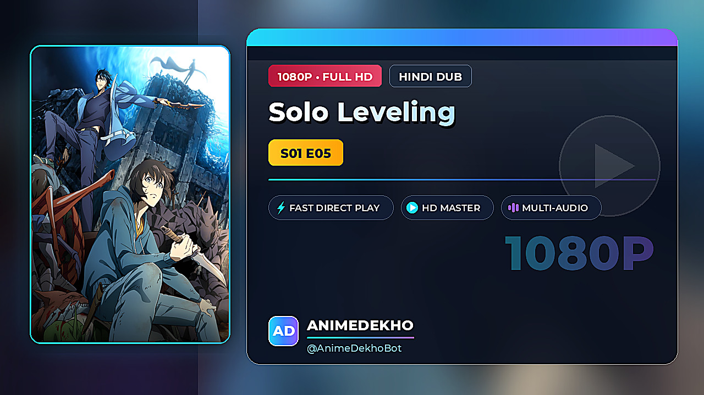
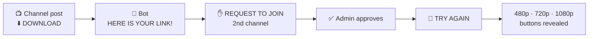
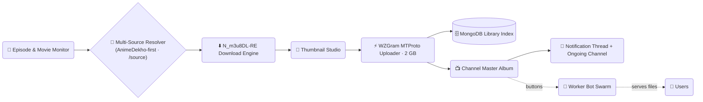

<div align="center">


<br>

<a id="top"></a>

# 「 🍥 AnimeDekho Bot 」

### *Next-Gen Anime Streaming · Archival · Channel Automation Engine*

<p>
  <a href="https://python.org"></a>
  <a href="https://github.com/TgbotWorld/animedekho-bot"></a>
  <a href="https://mongodb.com"></a>
  <a href="https://anilist.co"></a>
  <a href="https://github.com/TgbotWorld/animedekho-bot/stargazers"></a>
  <a href="LICENSE"></a>
</p>

<p>
  <a href="#overview"><b>🌌 Overview</b></a> &nbsp;•&nbsp;
  <a href="#features"><b>🔥 Features</b></a> &nbsp;•&nbsp;
  <a href="#commands"><b>⚡ Commands</b></a> &nbsp;•&nbsp;
  <a href="#architecture"><b>🧬 Architecture</b></a> &nbsp;•&nbsp;
  <a href="#configuration"><b>⚙️ Config</b></a> &nbsp;•&nbsp;
  <a href="#deployment"><b>🚀 Deploy</b></a> &nbsp;•&nbsp;
  <a href="#verification"><b>🧪 Verify</b></a>
</p>

</div>


<a id="overview"></a>

## 🌌 ᴏ ᴠ ᴇ ʀ ᴠ ɪ ᴇ ᴡ

> **AnimeDekho** turns any Telegram channel into a fully automated **anime streaming + archival platform** — no manual work, no duplicate posts, no ugly cards.

```diff
+ 🔎  Watches AnimeDekho for new episode & movie drops
+ 🖼️  Auto-generates Netflix-style 1280×720 streaming-card thumbnails (own logo + handle)
+ 🎞️  Downloads multi-quality streams — 480p → 720p → 1080p → 4K
+ 🎚️  Multi-source resolver — AnimeDekho-first default, switchable live via /source
+ 🩺  Per-stage diagnostics & health probes on every download
+ 📚  Maintains one beautiful master post per anime (updates in-place)
+ 🔔  Fans get notified in a tidy thread — channels stay clean
```


<a id="features"></a>

## 🔥 ꜰ ʟ ᴀ ɢ s ʜ ɪ ᴘ ꜰ ᴇ ᴀ ᴛ ᴜ ʀ ᴇ s

<table>
  <tr>
    <td width="50%">
      <h3>🎨 Auto Thumbnail Studio</h3>
      <p>One Netflix-style 1280×720 key-art card, stamped with your own handle and PNG logo.</p>
    </td>
    <td width="50%">
      <h3>📚 Smart Library Engine</h3>
      <p>One master post per anime — updated in-place. Movies auto-route away from series rows.</p>
    </td>
  </tr>
  <tr>
    <td width="50%">
      <h3>🤖 Autonomous AI Agent</h3>
      <p>Natural-language admin assistant — flip settings, search anime, run the bot by chat.</p>
    </td>
    <td width="50%">
      <h3>👥 Worker Bot Swarm</h3>
      <p>Attach unlimited child bots with per-bot quality tiers to serve files without limits.</p>
    </td>
  </tr>
  <tr>
    <td width="50%">
      <h3>🔒 Privacy-First Security</h3>
      <p>2-minute expiring invite links, auto media self-destruct countdown, ban / unban control.</p>
    </td>
    <td width="50%">
      <h3>⭐ Premium Emoji Support</h3>
      <p>First-class Telegram Premium custom emoji rendering with elegant Unicode fallbacks.</p>
    </td>
  </tr>
  <tr>
    <td width="50%">
      <h3>🎚️ Multi-Source Engine</h3>
      <p>AnimeDekho-first by default, then a chain of direct-file scrapers. Promote any source live with <code>/source</code> — no restart.</p>
    </td>
    <td width="50%">
      <h3>🩺 Self-Healing Downloads</h3>
      <p>Health probes pick the fastest healthy link; ZIP-wrapped MKVs auto-extract; failure cards report the exact stage &amp; reason.</p>
    </td>
  </tr>
</table>

### 🎨 Thumbnail Template

One style — a Netflix/streaming key-art card, auto-generated at 1280×720 for every upload.

| Piece                  | What it shows                                                        |
|------------------------|-----------------------------------------------------------------------|
| **Brand lockup**       | Your PNG logo (or a gradient monogram tile) + your channel handle      |
| **Eyebrow + rule**     | `ANIME • HINDI DUB` / `MOVIE • …` in wide-tracked caps                 |
| **Oversized title**    | Up to 3 auto-scaled lines, white on a soft shadow                      |
| **Metadata bullets**   | `EPISODES: 12 \| S01` · `AUDIO TRACK:` · `QUALITY:` (mirrors the post) |
| **CTA + quality pills**| Gradient `DOWNLOAD` button and the resolved tier (`1080P • FULL HD`)   |
| **Watermark**          | `@yourhandle` bottom-right over the feathered key art                  |

<code>THUMB_TEMPLATE</code> still accepts the retired names (`modern`, `cinematic`,
`movie_gold`, `neon_cyber`, `minimal`) — they all resolve to this one style, so
existing deployments render correctly after a pull.

Set your own branding (owner-only):

```bash
/thumbuser @YourChannel      # handle stamped in the lockup + watermark
/thumbuser clear             # fall back to the bot's own username
/thumblogo                   # reply to a PNG/JPG → install it top-left
/thumblogo clear             # back to the monogram tile
```

<div align="center">



<p><sub><code>streaming</code> template · auto-generated at 1280×720 for every upload</sub></p>

</div>

### 🔒 Gated DOWNLOAD (link gate)

Optional — **off by default**, so nothing changes until you switch it on. When
enabled, the channel post's quality rows collapse into a single
<kbd>⬇️ DOWNLOAD</kbd> button and the bot reveals 480p · 720p · 1080p only
after the viewer has passed a second channel:



```bash
/linkgate -100123456789 request   # join-request button (as in the demo)
/linkgate @secondchannel timer     # 2-minute expiring invite link
/linkgate @secondchannel link      # plain public link
/linkgate                          # show current state
/linkgate off                      # back to quality buttons on the post
/refreshalbums                     # re-render existing posts
```

`request` mode falls back to a timer link automatically if the bot lacks invite
rights, so the button is never dead. Owners skip the gate.

**END OF SEASON sticker** *(optional — skipped entirely when unset)*: reply to
any sticker with <kbd>/endsticker</kbd> and it is posted to the series channel
once a season's batch finishes with every episode delivered. `/endsticker clear`
removes it.


<a id="commands"></a>

## ⚡ ᴄ ᴏ ᴍ ᴍ ᴀ ɴ ᴅ s

Minimal surface for users — full arsenal for admins. Tap <kbd>/commands</kbd> inside the bot for the interactive catalog.

| Command            | What it does                              |
|--------------------|-------------------------------------------|
| <kbd>/start</kbd>   | Main menu + welcome banner                |
| <kbd>/search</kbd>  | Search anime across the entire database   |
| <kbd>/schedule</kbd>| Upcoming episodes & release cards         |
| <kbd>/commands</kbd>| Interactive visual command guide          |
| <kbd>/settings</kbd>| Real-time admin control panel *(admins)*  |

<details>
<summary><b>📂 &nbsp;Open the full command arsenal — 50+ commands</b></summary>
<br>

**👤 User Commands**

| Command       | Description                                  |
|---------------|----------------------------------------------|
| `/start`      | Main menu                                    |
| `/search`     | Search anime & movies                        |
| `/schedule`   | Anime airing schedule                        |
| `/commands`   | Interactive command navigator                |
| `/help`       | Usage manual                                 |
| `/tutorial`   | Bot network guide & tutorials                |

**🎛️ Admin Core**

| Command           | Description                              |
|-------------------|------------------------------------------|
| `/settings`       | Visual control panel with live toggles   |
| `/stats`          | VPS stats & performance card             |
| `/health`         | System health & bot status               |
| `/logs`           | Environment logs & export                |
| `/errors`         | Recent download errors                   |
| `/users`          | User analytics & registered count        |
| `/source`         | Show / change the default download source *(owner)* |
| `/bypass`         | Manually resolve a source URL *(owner)*  |
| `/adduser`        | Approve a user                           |
| `/removeuser`     | Remove a user                            |

**📡 Broadcast & Moderation**

| Command       | Description                          |
|---------------|--------------------------------------|
| `/broadcast`  | Broadcast text to all users          |
| `/pbroadcast` | Broadcast photo to all users         |
| `/dbroadcast` | Broadcast file to all users          |
| `/ban`        | Ban user from bot network            |
| `/unban`      | Unban user                           |

**📺 Channel, Library & Styling**

| Command           | Description                                    |
|-------------------|------------------------------------------------|
| `/autochannel`    | Toggle auto channel creation                   |
| `/createchannel`  | Create a channel for an anime                  |
| `/channels`       | List mapped anime channels                     |
| `/albummode`      | Configure album display mode                   |
| `/refreshalbums`  | Refresh channel album buttons                  |
| `/setchannellink` | Set channel invite link                        |
| `/delete`         | Delete a series or file                        |
| `/setdump`        | Configure dump storage channel                 |
| `/poststyle`      | Channel post style status (modern-only, V3 #7) |
| `/startstyle`     | /start UI style status (modern-only, V3 #7)      |
| `/schedstyle`     | /schedule UI style status (modern-only, V3 #7)   |
| `/epstyle`        | Episode post style status (modern-only, V3 #7)   |
| `/startpic`       | Set banner photo for /start modern UI          |
| `/setthumb`       | Set custom upload thumbnail                    |
| `/delthumb`       | Delete custom thumbnail                        |
| `/thumbuser`      | Set the channel handle shown on thumbnails *(owner)* |
| `/thumblogo`      | Set the PNG logo shown on thumbnails *(owner)* |
| `/mapchannel`     | Map a dedicated channel to a series *(owner)*      |
| `/linkgate`       | Gate the post's DOWNLOAD button behind a 2nd channel *(owner)* |
| `/endsticker`     | Set the END OF SEASON sticker *(owner)*            |

**🔐 ForceSub & Timers**

| Command      | Description                          |
|--------------|--------------------------------------|
| `/fsub`      | Manage Force Subscribe channel       |
| `/fsub_mod`  | Toggle 2-min timer FSub links        |
| `/dlt_time`  | Configure file auto-delete timer     |

**🤖 AI · 👥 Worker Bots · 🧑‍💻 Userbot**

| Command          | Description                            |
|------------------|----------------------------------------|
| `/ai`            | Autonomous AI agent                    |
| `/setai`         | Configure AI model, key & persona      |
| `/addbot`        | Add a child worker bot                 |
| `/delbot`        | Remove a child worker bot              |
| `/bots`          | List child worker bots                 |
| `/setbotquality` | Set child bot quality tier             |
| `/login`         | Login userbot session wizard           |
| `/logout`        | Logout userbot session                 |
| `/userbot`       | Userbot status & options               |
| `/automonitor`   | Automatic episode monitoring           |

</details>


<a id="architecture"></a>

## 🧬 ᴀ ʀ ᴄ ʜ ɪ ᴛ ᴇ ᴄ ᴛ ᴜ ʀ ᴇ




<a id="configuration"></a>

## ⚙️ ᴄ ᴏ ɴ ꜰ ɪ ɢ ᴜ ʀ ᴀ ᴛ ɪ ᴏ ɴ

Configure via `.env` **or** edit `config.py` directly — both are first-class. Copy the template:

```bash
cp .env.example .env
```

**Required to boot**

| Variable      | Description                                        |
|---------------|----------------------------------------------------|
| `API_ID`      | Telegram API ID — [my.telegram.org](https://my.telegram.org) |
| `API_HASH`    | Telegram API Hash                                  |
| `BOT_TOKEN`   | Bot token from [@BotFather](https://t.me/BotFather)|
| `OWNER_ID`    | Your Telegram user ID                              |
| `MONGO_URI`   | MongoDB connection string (Atlas or local)         |
| `MAIN_CHANNEL`| Main library channel ID (`-100…`)                  |

<details>
<summary><b>🧰 &nbsp;Show every option (styling, AI, security, thumbnails…)</b></summary>
<br>

| Variable                | Description                                            | Default      |
|-------------------------|--------------------------------------------------------|--------------|
| `ADMINS`                | Extra admin IDs, space-separated                       | —            |
| `LOG_CHANNEL`           | Admin log / error channel ID                           | `0`          |
| `DUMP_CHANNEL`          | Storage dump channel (`0` = off)                       | `0`          |
| `ONGOING_CHANNEL`       | Ongoing-episode notification channel                   | `0`          |
| `FSUB_CHANNEL`          | Force-sub channel (defaults to main)                   | —            |
| `NETWORK_CHANNEL_LINK`  | Link for the *download network* button                 | `t.me/animedekho` |
| `DATABASE_NAME`         | MongoDB database name                                  | `animedekho_bot` |
| `THUMB_TEMPLATE`        | Thumbnail style — `streaming` (legacy names alias to it)             | `streaming` |
| `RANDOM_THUMB_TEMPLATE` | *(retired — single style)*                                           | `off`        |
| `THUMB_BRAND_USERNAME`  | Channel handle stamped on thumbnails                                 | —            |
| `THUMB_BRAND_LOGO`      | Path to the PNG logo in the thumbnail lockup                         | —            |
| `AUTO_THUMB`            | Auto-generate branded thumbnails                       | `on`         |
| `AUTO_SEARCH`           | Type-in-chat search trigger                            | `on`         |
| `FSUB_MOD`              | 2-minute expiring invite links                         | `on`         |
| `AUTO_DELETE_TIME`      | Media self-destruct timer (seconds, `0` = off)         | `600`        |
| `AUTO_SCHEDULE_POST`    | Daily schedule card at 12 AM IST                       | `off`        |
| `START_STYLE` / `SCHED_STYLE` / `EP_STYLE` / `POST_STYLE` | UI styles: `modern`-only (classic retired, V3 #7) | `modern` |
| `START_PIC` / `START_MSG` | Custom /start banner & text                          | —            |
| `FSUB_PIC` / `FSUB_MSG` | Custom FSub banner & text                              | —            |
| `DEFAULT_ANIME_THUMB` / `DEFAULT_MOVIE_THUMB` | Fallback posters              | Unsplash URLs|
| `ENABLE_CUSTOM_EMOJI`   | Render Telegram Premium custom emojis                  | `false`      |
| `AI_API_KEY` / `AI_BASE_URL` / `AI_MODEL` / `AI_ENABLED` | Autonomous AI agent tuning | `gpt-4o` |
| `LOG_LEVEL`             | `DEBUG` · `INFO` · `WARNING` · `ERROR`                 | `INFO`       |

</details>

> **🛰️ Runtime settings** — some switches live in the database, not `.env`, so they apply instantly to every worker without a restart:
> <kbd>/source</kbd> *(default download source — AnimeDekho-first)* · <kbd>/albummode</kbd> · <kbd>/poststyle</kbd> · <kbd>/dlt_time</kbd> · <kbd>/setbotquality</kbd>


<a id="deployment"></a>

## 🚀 ᴅ ᴇ ᴘ ʟ ᴏ ʏ ᴍ ᴇ ɴ ᴛ

<details open>
<summary><b>🐳 &nbsp;Docker Compose — recommended</b></summary>
<br>

```bash
git clone https://github.com/TgbotWorld/animedekho-bot.git
cd animedekho-bot
cp .env.example .env        # fill in your values
docker compose up -d --build
```

Ships with the **VidStream API sidecar** wired in automatically. `ffmpeg` + `N_m3u8DL-RE` are baked into the image.

</details>

<details>
<summary><b>⚡ &nbsp;One-shot Ubuntu / EC2 setup</b></summary>
<br>

```bash
git clone https://github.com/TgbotWorld/animedekho-bot.git
cd animedekho-bot
bash setup.sh
```

Installs Docker, asks for your credentials interactively, builds the image and launches the bot.

</details>

<details>
<summary><b>💻 &nbsp;Local PC &amp; Bare-metal VPS Setup Guide (Windows / Linux / macOS)</b></summary>
<br>

#### 1. System Requirements & Prerequisites
- **Python:** `3.10`, `3.11`, `3.12` (compatible with `3.14`)
- **FFmpeg:** Required on system `PATH` for video remuxing and audio track preservation
- **N_m3u8DL-RE:** *(Recommended)* For fast multi-threaded multi-audio HLS/DASH downloads
- **MongoDB:** MongoDB Atlas free tier URI or local instance (v5.0+)
- **Telegram App Credentials:** `API_ID` &amp; `API_HASH` from [my.telegram.org](https://my.telegram.org), plus `BOT_TOKEN` from [@BotFather](https://t.me/BotFather)

#### 2. Step-by-Step Installation

```bash
# 1. Clone the repository
git clone https://github.com/TgbotWorld/animedekho-bot.git
cd animedekho-bot

# 2. Create and activate a virtual environment
python3 -m venv venv

# On Linux / macOS:
source venv/bin/activate

# On Windows (PowerShell / Command Prompt):
venv\Scripts\activate

# 3. Upgrade pip and install dependencies
pip install --upgrade pip
pip install -r requirements.txt

# 4. Install FFmpeg
# On Ubuntu / Debian:
sudo apt update && sudo apt install -y ffmpeg

# On macOS (Homebrew):
brew install ffmpeg

# On Windows (winget):
winget install Gyan.FFmpeg

# Verify FFmpeg is available on PATH:
ffmpeg -version

# 5. Configure environment variables
cp .env.example .env
# Edit .env and enter your credentials:
# BOT_TOKEN, API_ID, API_HASH, OWNER_ID, MONGO_URI, MAIN_CHANNEL

# 6. Run the bot
python main.py
```

#### 3. Common Errors & Troubleshooting

| Error | Root Cause | Solution |
|---|---|---|
| `FFmpeg not found in PATH` | FFmpeg executable not in system environment variables | Verify with `ffmpeg -version`. If installed manually on Windows, add its `bin/` folder to your User/System `Path` and restart terminal. |
| `ServerSelectionTimeoutError` | MongoDB connection timed out / blocked | In MongoDB Atlas, navigate to **Network Access** &rarr; **Add IP Address** &rarr; select **Allow Access from Anywhere (`0.0.0.0/0`)**. Verify your username and password in `MONGO_URI`. |
| `Telegram API FLOOD_WAIT` | Rate limit imposed by Telegram servers | The bot has built-in exponential backoff. Wait out the cooldown period; avoid bulk-spamming buttons rapidly. |
| `Audio missing / dropped in download` | Stream has separate audio tracks | Ensure FFmpeg 5.0+ is installed (`-map 0:a?` copies all tracks). For HLS multi-audio, ensure `N_m3u8DL-RE` is installed. |
| `ModuleNotFoundError` | Dependencies installed in different environment | Ensure your virtual environment is active (`(venv)` indicator in terminal) before running `pip install -r requirements.txt`. |

</details>

<details>
<summary><b>🚅 &nbsp;Railway</b></summary>
<br>

`railway.json` is already configured (Dockerfile builder, auto-restart). Import the repo, set the env vars from `.env.example`, hit deploy. A classic `Procfile` is also included for worker-style platforms.

</details>


<a id="verification"></a>

## 🧪 ᴠ ᴇ ʀ ɪ ꜰ ʏ

Contributing — or just want to check a change? The offline suite runs without Telegram, MongoDB or network:

```bash
python tests/test_v3_offline.py   # resolver, ZIP, diagnostics, /source & thumbnail checks
python -m pytest tests/ -q        # unit tests
```


## 📜 ʟ ɪ ᴄ ᴇ ɴ s ᴇ

Distributed under the **MIT License** — see [LICENSE](LICENSE). Free to use, modify and deploy.

<div align="center">

**Made with ❤️ for the anime community**

If AnimeDekho powers your channel, drop a ⭐ on the repo — it keeps the releases coming.


</div>
